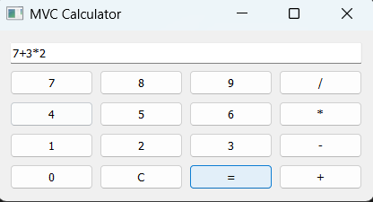
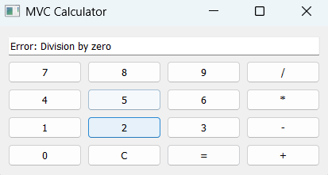

# MVC Calculator (PyQt)

## Description
This project implements a simple calculator using the MVC (Model-View-Controller) pattern.

## Structure

Model
- Calculator class handles logic

Controller
- CalculatorWindow handles GUI and user interaction

View
- PyQt GUI

## Run

Install dependencies:

pip install PyQt5

Run program:

python main.py

## Example input/output

Input:
7 + 3 * 2

Output:
13

Input:
10 / 0

Output:
Error: Division by zero

