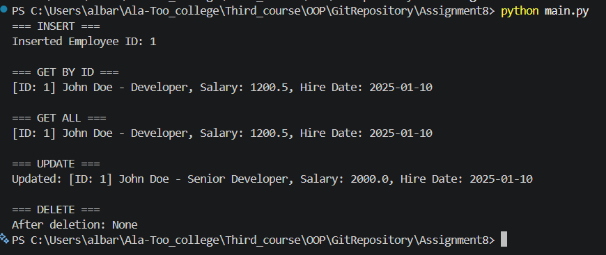
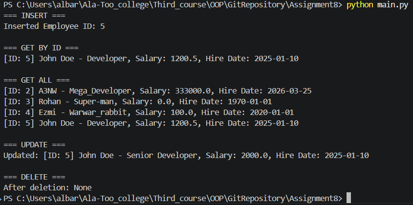

# Employee Database (Python + SQLite)

## Description
This project implements CRUD operations for managing employees using SQLite.

## Features
- Add employee
- View employee by ID
- View all employees
- Update employee
- Delete employee

## How to Run

```bash
python main.py
```

## Example Output
```plain text
=== INSERT ===
Inserted Employee ID: 1

=== GET BY ID ===
[ID: 1] John Doe - Developer, Salary: 1200.5, Hire Date: 2025-01-10

=== GET ALL ===
[ID: 1] John Doe - Developer, Salary: 1200.5, Hire Date: 2025-01-10

=== UPDATE ===
Updated: [ID: 1] John Doe - Senior Developer, Salary: 2000, Hire Date: 2025-01-10

=== DELETE ===
After deletion: None
```

### What happens?
INSERT → adds employee to DB
GET BY ID → fetch one row
GET ALL → fetch all rows
UPDATE → change data
DELETE → remove employee

## Screenshots

